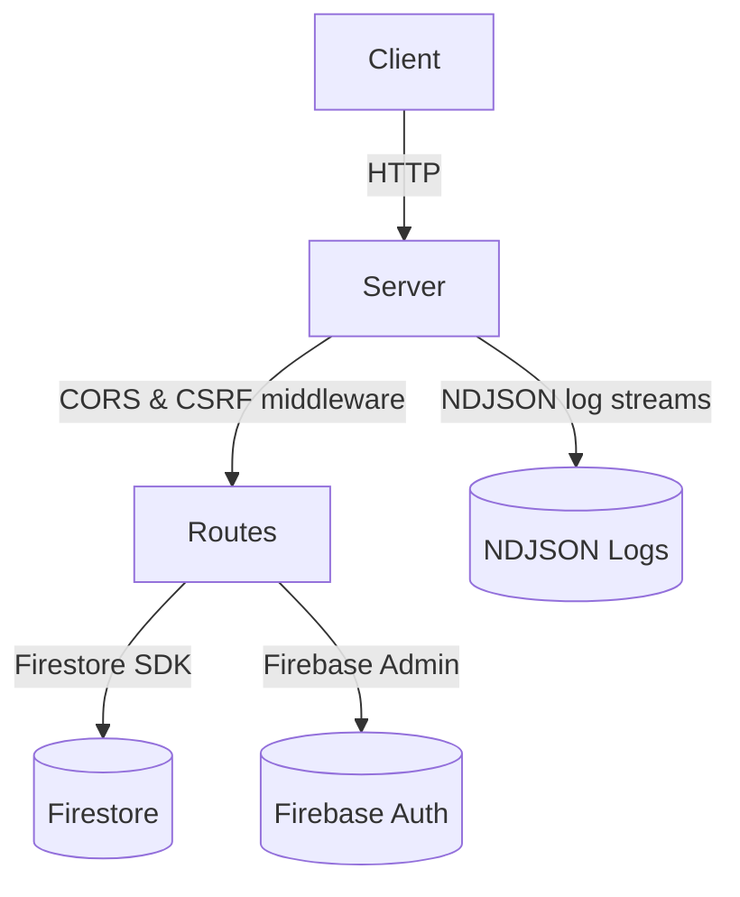

# Backend Architecture Overview

## Directory Overview
- **events/** – endpoints that keep a per-session list of ad-hoc events in memory.
- **live/** – PTCG Live API handlers and aggregations backed by Firestore.
- **importing/** – parses client log files and commits them through `/import-logs`.
- **logs/** – exposes recent request logs stored in the session.
- **middleware/** – shared Express middleware such as Firebase authentication.

## CORS, CSRF and NDJSON Logs

### CORS
The server uses the [`cors`](https://github.com/expressjs/cors) package with a single allowed origin taken from `CORS_ORIGIN`.
Credentials are enabled and a preflight handler is registered. Only `Content-Type`,
`Authorization` and `X-CSRF-Token` headers are accepted.

### CSRF
A double-submit token is issued in a `csrfToken` cookie (`SameSite=Strict`,
`HttpOnly` and `Secure` in production). For non-idempotent requests the client must
send the same value in the `X-CSRF-Token` header or the request is rejected with `403`.
See [docs/CSRF.md](../../docs/CSRF.md) for the full flow.

### NDJSON log rotation
Each request and JSON response is appended to `logs/requests.ndjson` and
`logs/responses.ndjson`. Once a file reaches **5&nbsp;MB** it is renamed with a
timestamp and a new file is opened, providing simple size-based log rotation.

## Request Flow and External Dependencies

