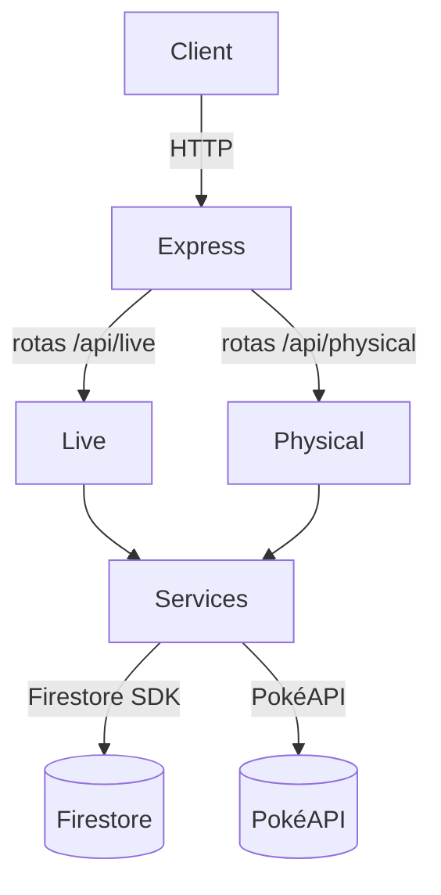

# Arquitetura Geral

O projeto expõe dois conjuntos de rotas na API Express:

- **/api/live/** – registra e agrega partidas do TCG Live.
- **/api/physical/** – registra eventos do TCG Físico.

Cada grupo mantém suas próprias coleções no Firestore e processa agregações
independentemente.

## Camada de serviços

Funções compartilhadas residem em `src/services/` e são usadas por ambas as
rotas. Elas isolam integrações externas e reutilizam lógica:

- `pokedex.js` – consulta a PokéAPI e armazena resultados em cache no Firestore.
- `deckHints.js` – sugere Pokémon para nomes de decks.

As rotas chamam essas funções em vez de acessar APIs externas diretamente.

## Fluxo de requisição

